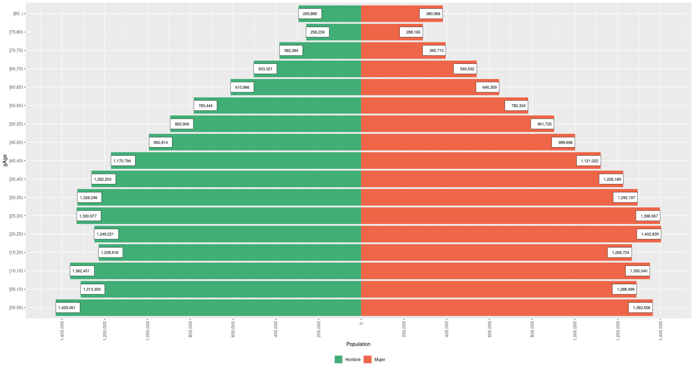
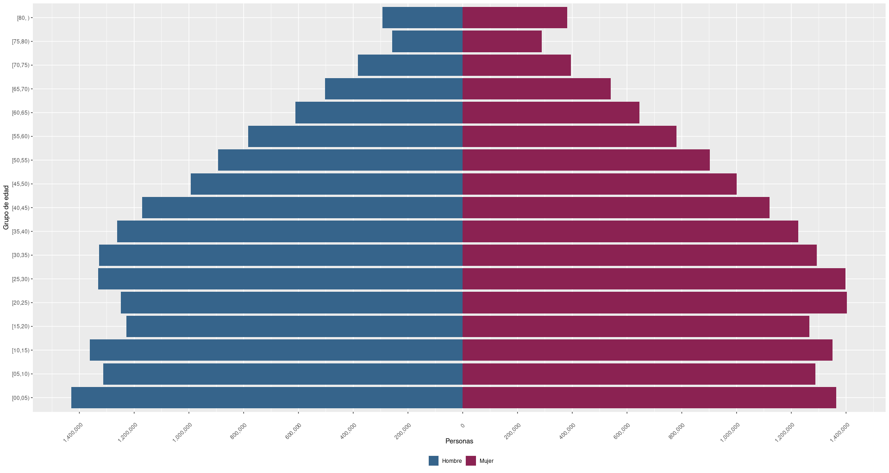
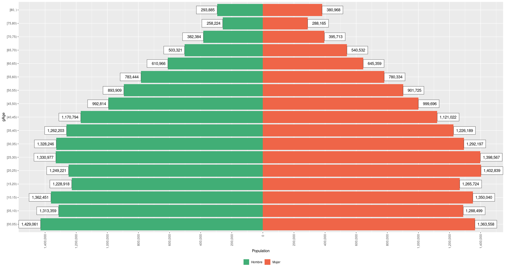
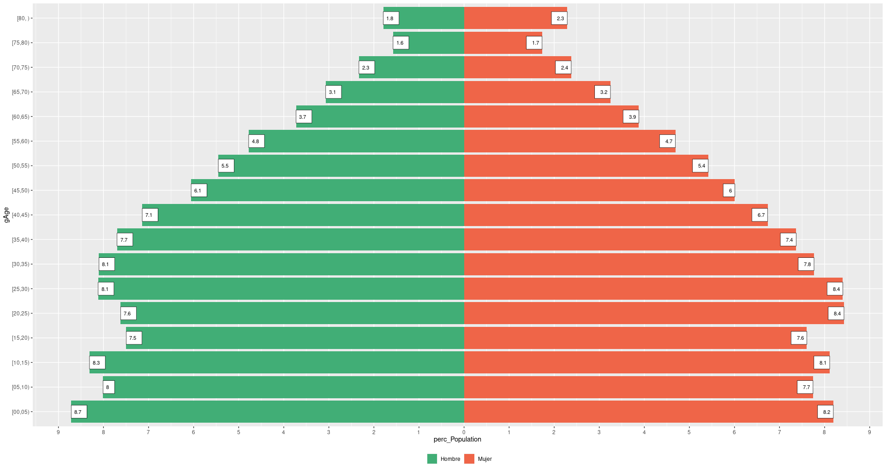
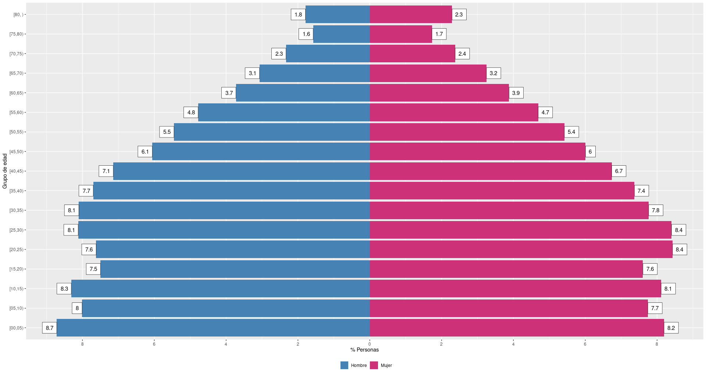

# popPyramid 

<!-- badges: start -->


[](https://github.com/ellerbrock/open-source-badges/)
[](https://www.repostatus.org/#active)

[](https://CRAN.R-project.org/package=popPyramid)
[](https://CRAN.R-project.org/package=popPyramid)

<!-- badges: end -->

[**popPyramid**](https://github.com/musajajorge/popPyramid/) is a package that facilitates the elaboration of population pyramids.

## Installation :arrow_double_down:

Install **popPyramid** from [**CRAN**](https://CRAN.R-project.org/package=popPyramid):

``` r
install.packages("popPyramid")
```

or install **popPyramid** with

``` r
library(remotes)
install_github("musajajorge/popPyramid")
```

## Usage :muscle:

### Peru's population pyramid, year 2021

Using the default parameters.

``` r
df <- popPyramid::popPER
df <- dplyr::filter(df, Year==2021)
library(popPyramid)
plotPyramid(df=df, age="gAge", sex="Sex", pop="Population")
```



### Peru's population pyramid, year 2021

Modifying the colors, X and Y axis labels, as well as the rotation of the X axis labels.

``` r
df <- popPyramid::popPER
df <- dplyr::filter(df, Year==2021)
library(popPyramid)
plotPyramid(df=df, age="gAge", sex="Sex", pop="Population",
            labx="Personas", laby="Grupo de edad",
            twocolors=c("steelblue","violetred3"),
            rotation=45, n.breaks=15, value.labels=FALSE)
```



### Peru's population pyramid, year 2021

Modifying the position of the values in the bars.

``` r
df <- popPyramid::popPER
df <- dplyr::filter(df, Year==2021)
library(popPyramid)
plotPyramid(df=df, age="gAge", sex="Sex", pop="Population",
            value.labels=TRUE, position.value.labels = "out",
            size.value.labels=4)
```



### Percentage pyramid of Peru's population, year 2021

Using the default parameters.

``` r
df <- popPyramid::popPER
df <- dplyr::filter(df, Year==2021)
df <- percDF(df, "gAge", "Sex", "Population")
library(popPyramid)
plotPercPyramid(df=df, age="gAge", sex="Sex", perpop="perc_Population")
```



### Percentage pyramid of Peru's population, year 2021

Modifying the position of the values on the bars, the X and Y axis labels and the colors of the bars.

``` r
df <- popPyramid::popPER
df <- dplyr::filter(df, Year==2021)
df <- percDF(df, "gAge", "Sex", "Population")
library(popPyramid)
plotPercPyramid(df=df, age="gAge", sex="Sex", perpop="perc_Population",
                labx="% Personas", laby="Grupo de edad", n.breaks=10,
                twocolors=c("steelblue","violetred3"),
                value.labels=TRUE, position.value.labels="out",
                size.value.labels=4)
```



------------

<p align="center">
    
</p>
